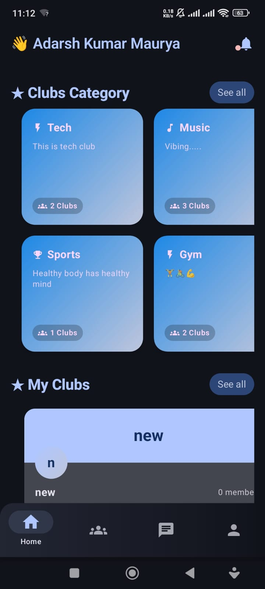
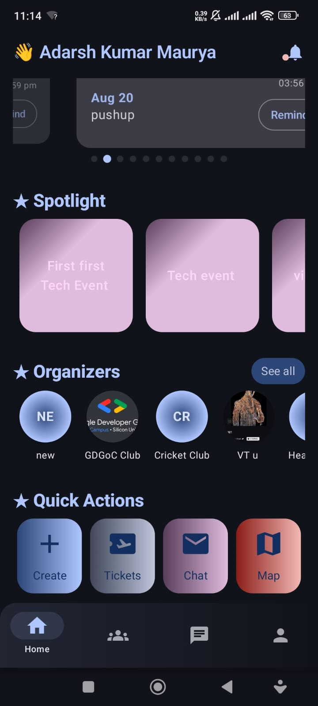
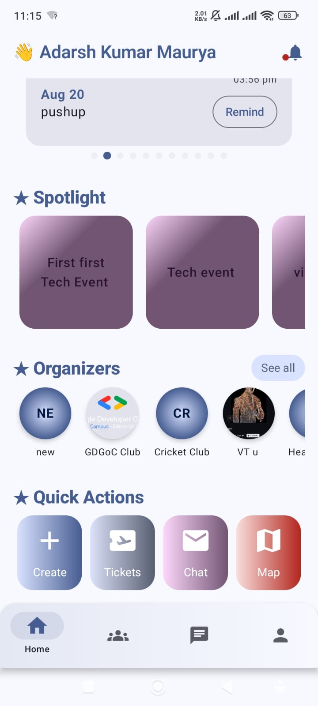
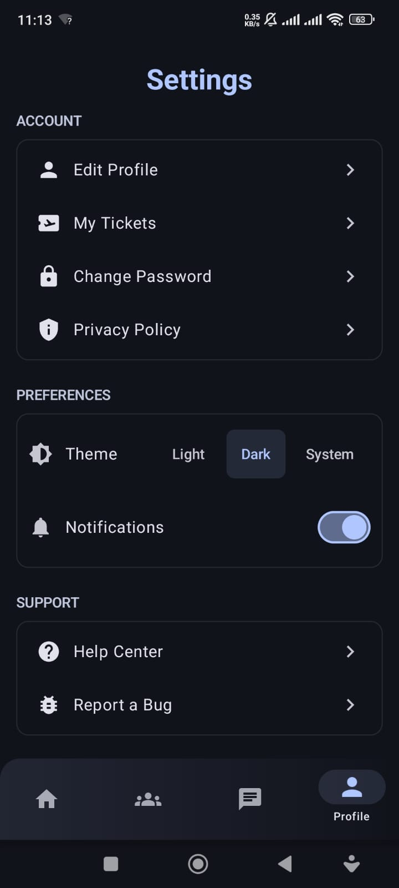

# 🐝 Event Hive

**Event Hive** is a premium, high-performance college ecosystem built with **Jetpack Compose** and **Firebase**. It serves as a centralized hub for student clubs to manage events, registrations, and real-time community engagement with industry-standard security and a unique **Claymorphic (Soft UI)** design.

---

## ✨ Key Highlights

*   🎨 **Claymorphism UI**: A unique, tactile visual identity featuring 3D soft shadows and glossy highlights.
*   🛡️ **Hardened Security**: Professional-grade RBAC with server-side permission flattening and spoof-proof messaging.
*   🚀 **Performance Optimized**: Parallel data fetching and intelligent caching reducing latency by >90%.
*   🧪 **100% Core Coverage**: 23+ automated unit tests ensuring atomic business logic for registrations and payments.
*   🤖 **CI/CD Integrated**: Automated testing and build pipelines via GitHub Actions.

---

## 📸 Visual Journey

### 🎨 Design Language: Claymorphism

  
  
  
  

---

## 🛠 Tech Stack & Architecture

| Layer | Technology |
| :--- | :--- |
| **Frontend** | Kotlin, Jetpack Compose, Material 3, Coroutines, Flow |
| **Backend** | Firestore (Metadata), RTDB (Live Chat), Cloud Functions (Logic) |
| **DI / State** | Hilt, MVVM + Clean Architecture, StateFlow |
| **Media** | Coil (Image Loading), ZXing (QR Ticket Generation) |
| **Testing** | JUnit 4, MockK, Turbine, GitHub Actions |

---

## 📋 Documentation Hub

Detailed technical and product documentation is available in the project root:

1.  **[PRD.md](./PRD.md)**: Vision, Personas, and Functional Requirements.
2.  **[TRD.md](./TRD.md)**: Technical Architecture and Security Model.
3.  **[audit.md](./audit.md)**: Professional Security and Performance Audit **(Score: 4.9/5.0)**.
4.  **[BackendSchema.md](./BackendSchema.md)**: Database tree and collection structures.
5.  **[AppFlow.md](./AppFlow.md)**: User journeys and state transitions.
6.  **[test.md](./test.md)**: Comprehensive testing report and infrastructure details.
7.  **[CI_CD.md](./CI_CD.md)**: Automation pipeline and secret management.

---

## ⚙️ Getting Started

### Prerequisites
*   Android Studio Ladybug or newer.
*   A connected Firebase Project.

### Setup
1.  **Clone**: `git clone https://github.com/akmaurya7/EventHive.git`
2.  **Firebase Config**: Place your `google-services.json` in the `app/` directory.
3.  **Realtime Database**: Ensure your database URL is correctly set in `AppModule.kt`.
4.  **Run Tests**: `./gradlew test` to verify the installation.

---

## 📞 Contact & Contributors

| Name | Role | GitHub | LinkedIn |
| :--- | :--- | :--- | :--- |
| **Sanskar Lohani** | Lead Developer | [@sanskarlohani](https://github.com/sanskarlohani) | [Profile](https://linkedin.com/in/sanskarlohani12) |
| **Adarsh Kumar Maurya** | Contributor | [@akmaurya7](https://github.com/akmaurya7) | [Profile](https://linkedin.com/in/yourprofile) |

---

## 📄 License
Licensed under the **MIT License**. See [LICENSE](./LICENSE) for more information.
