# 📱 Su Events


**SU Events** is a modern Android application built with **Jetpack Compose** (Kotlin) and powered by **Firebase**.  

It serves as a unified digital platform to streamline operations for college clubs — from event hosting and registrations to member management and centralized data tracking.


---

## 📸 Screenshots

<div align="center">
  
  
  
</div>

<div align="center">
  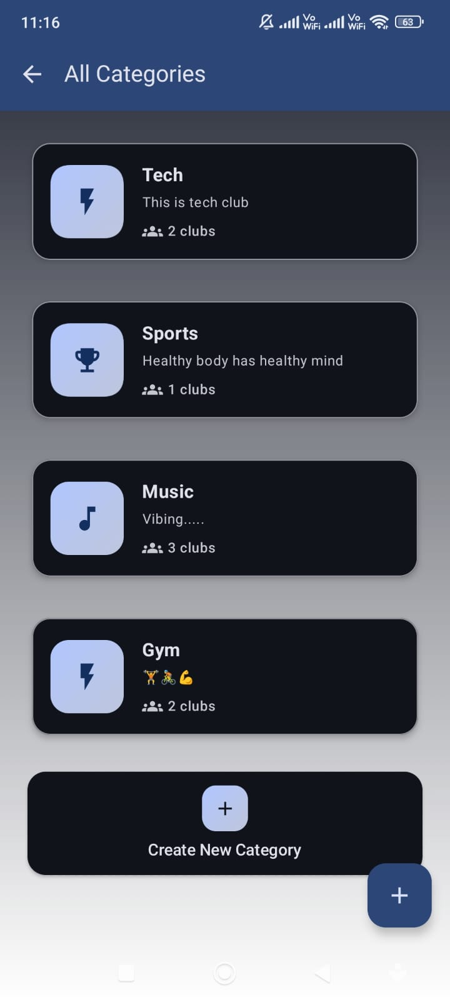
  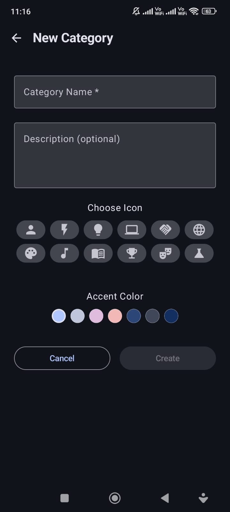
  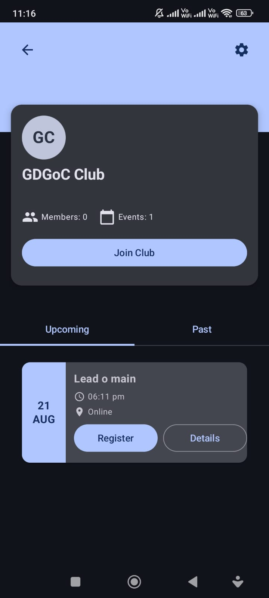
</div>

<div align="center">
  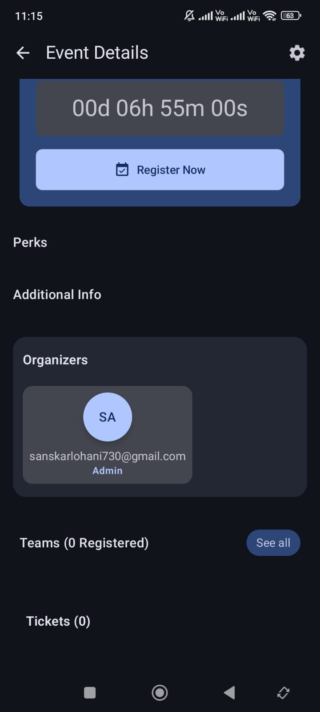
  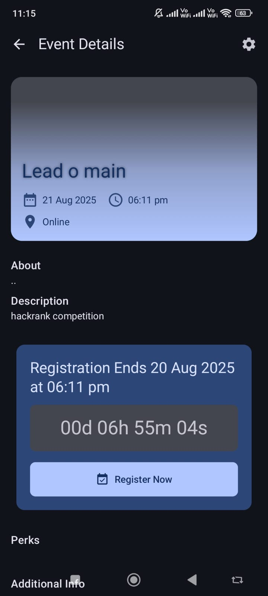
  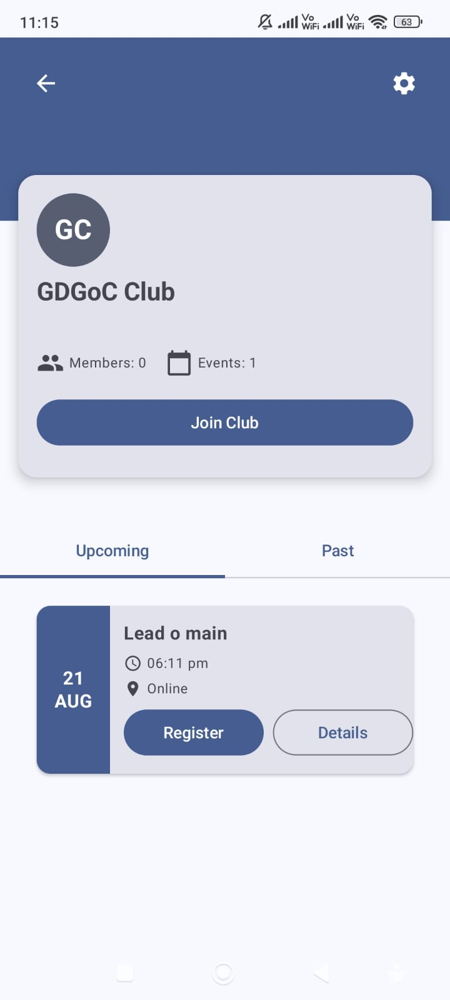
</div>

<div align="center">
  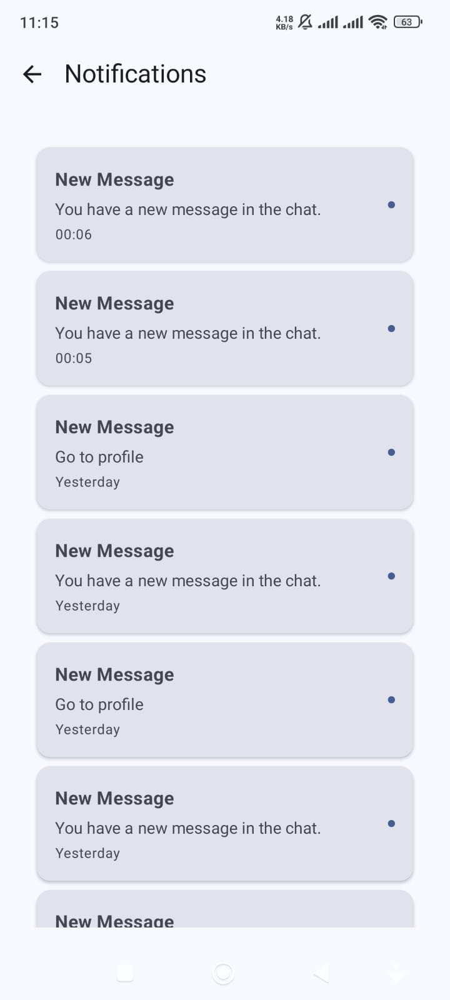
  
  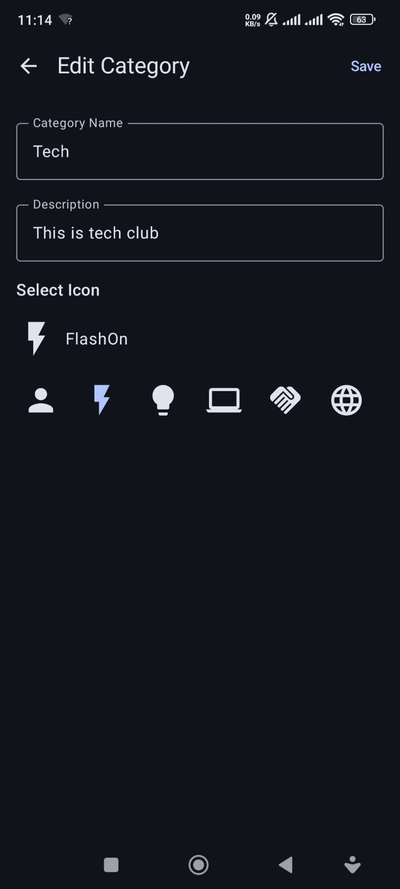
</div>

<div align="center">
  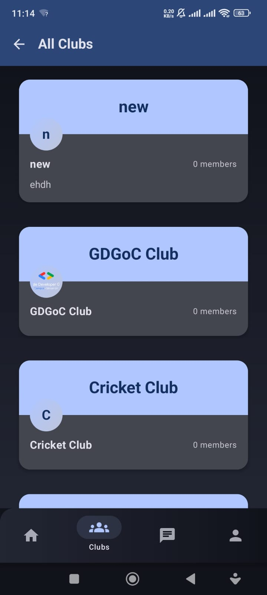
  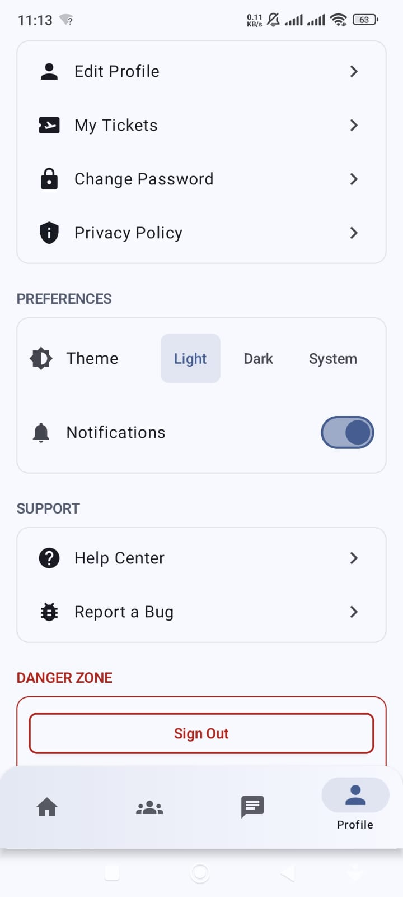
  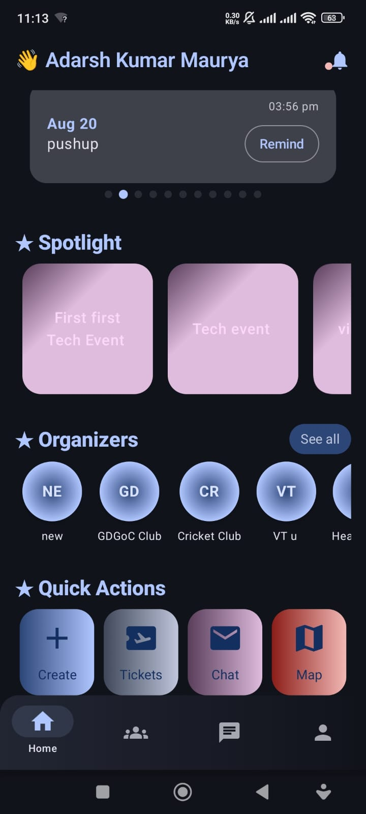
</div>

<div align="center">
  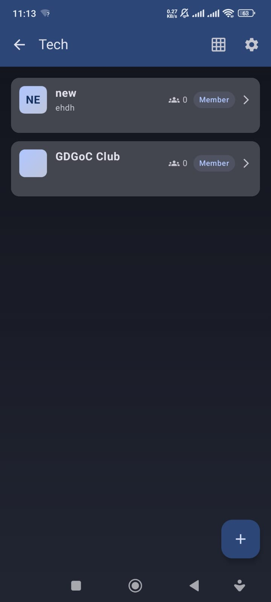
  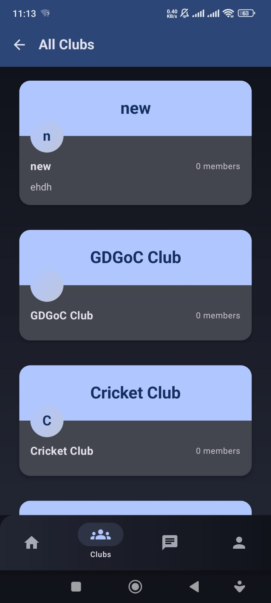
  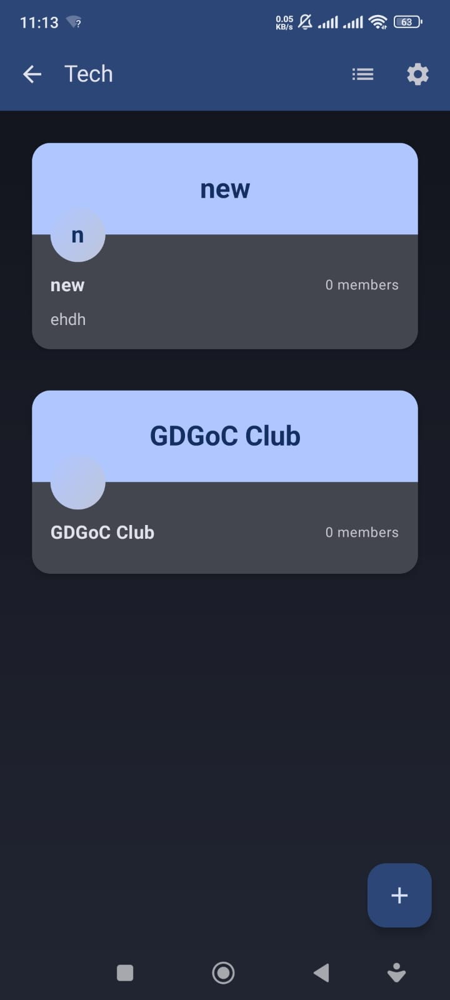
</div>

<div align="center">
  
  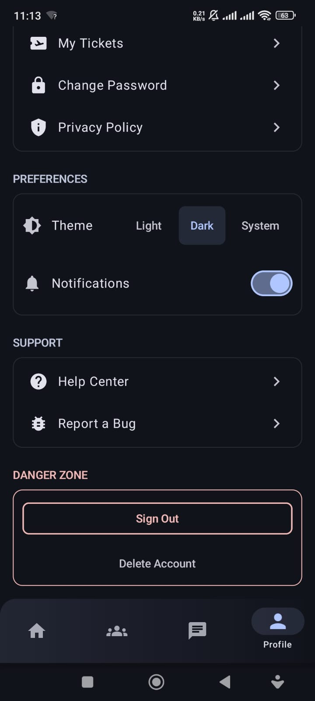
</div>

## 🎥 Demo Video

<div align="center">
  <video width="400" controls>
    <source src="sc/Untitled video - Made with Clipchamp.mp4" type="video/mp4">
    Your browser does not support the video tag.
  </video>
</div>

*Screenshots and video showcasing the Event Hive application interface and features*

---

## 🚀 Features

- 📆 **Event Management**: Create, host, and manage club events.
- 🧑‍🤝‍🧑 **Member Registration & Tracking**: Easily register members and monitor participation.
- 🏢 **Club Organization**: Organize and centralize all club operations in one place.
- 📂 **Data Management**: Secure storage and access of all club-related data via Firebase.
- ✅ **Workflow Optimization**: Smoothens day-to-day tasks for student clubs and organizers.

---

## 🛠 Tech Stack

| Layer        | Technologies Used                        |
|--------------|------------------------------------------|
| Frontend     | Android, Kotlin, Jetpack Compose         |
| Backend      | Firebase Authentication, Firestore, Storage |

---

## ⚙️ Getting Started

### ✅ Prerequisites

- Android Studio (latest version recommended)
- A configured Firebase project

### 🔧 Setup Instructions

1. **Clone the repository**:
   ```bash
   git clone https://github.com/akmaurya7/EventHive.git
   
   ```
2. **Open the project in Android Studio.**
3. **Make your own ``` google-service.json ``` file by creating a project in firebase to run the app**
4. **Connect the app to Firebase**  
   Follow the official [Firebase setup guide](https://firebase.google.com/docs/android/setup).
5. **Build and run the app** on an emulator or a physical Android device.

---

## 📲 Usage

- Register as a club member or event participant
- Host and manage events within the app
- Organize club workflows and access all event/member data from one platform

---

## 🤝 Contributing

Contributions are welcome!  
If you encounter issues or have suggestions, feel free to open an issue or submit a pull request.

---

## 📞 Contact Us

<div align="center">

### Get in Touch

| Platform | Adarsh Kumar Maurya | Sanskar Lohani |
|----------|--------------------|--------------------|
| 📧 **Email** | [your.email@example.com](mailto:your.email@example.com) | [lohani12.sanskar@gmail.com](mailto:lohani12.sanskar@gmail.com) |
| 🐙 **GitHub** | [@yourusername](https://github.com/yourusername) | [@sanskarlohani](https://github.com/sanskarlohani) |
| 💼 **LinkedIn** | [Adarsh Kumar Maurya](https://linkedin.com/in/yourprofile) | [Sanskar Lohani](https://linkedin.com/in/sanskarlohani12) |

</div>

*Feel free to reach out for any questions, suggestions, or collaboration opportunities!*

---

## 📄 License

This project is licensed under the MIT License.
